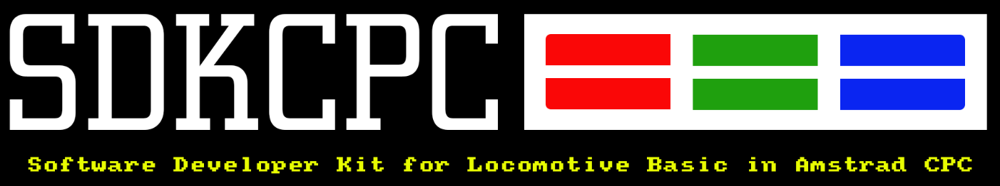
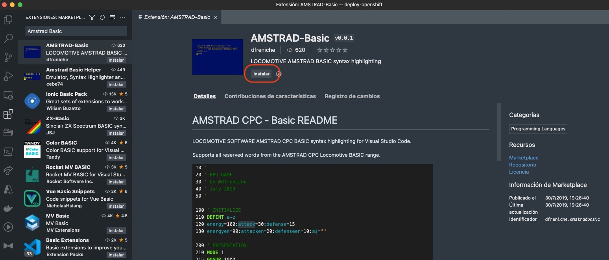

# SDKCPC (Software Developer Kit para Amstrad CPC)



**SDKCPC** son una serie de librerias y programas multiplataforma desarrollados en *[Python](https://www.python.org/downloads/)*. que nos sirve para facilitarnos la vida en la programación con Locomotive Amstrad Basic, en ordenadores actuales. **SDKCPC** se distribuye bajo licencia [LGPL v3](https://www.python.org/downloads/)

**SDKCPC** incluye: 

- Integración con Vscode
- Snnipet integrado para Basic y para la libreria [8BP](https://github.com/jjaranda13/8BP)
- Integración con gestor de versiones Git
- Creación DSK
- Comentarios en codigo que no ocupan memoria.
- Trabajo por objetos
- Verificacion formato 8:3
- Compatible con Emulador: Retro Virtual Machine
- Integración con M4-Board
- y mucho mucho más.....


## Plataformas compatibles

- Windows 10 o Superior
- OS X
- Linux


## Requisitos de Software


### Windows/Linux And OSX
| Software  | Version  | Url |
|:----------|:----------|:----------|
| Python    | =>3.6    | [Descarga](https://www.python.org/downloads/)    |
| Visual Studio Code    | latest   | [Descarga](https://code.visualstudio.com/download)    |

### Instalar Extensiones en Visual Studio Code.

Para que nuestra experiencia de programacion sea mas agradable, es recomendable instalar la extension Amstrad-Basic de **dfreniche**. De esta forma conseguimos el resaltado de sintaxis para los bloques de código fuente Basic. Desde el Gestor de extensiones de Visual Studio Code buscaremos la extension Amstrad-Basic y pulsaremos *instalar*.




### Historial
| Fecha  | Version  | Cambios  |
|:----------|:----------|:----------|
| 01.10.2022   | 1.0.0  | Versión inicial del proyecto.    |


## Instalación SDKCPC en tu sistema

Para instalar **SDKCPC** en tu sistema por favor realice los siguientes pasos:

1. Instale los [Requisitos de Software](#Requisitos-de-Software) de su sistema.
2. Una vez instalados ejecute el siguiente comando desde el cmd/terminal de sus sistema:

```
pip install sdkcpc
```
o

```
pip3 install sdkcpc
```
Dependiendo del sistema operativo.


3. Cierre la terminal desde donde lo ejecuto.

Puede comprobar la instalacion del software y sus requisitos escribiendo desde un nuevo cmd/Terminal, que le devolvera la versión instalada del software:

```
sdkcpc --version
```


## Como usar SDKCPC
Podemos ver todas las opciones del programa escribiendo el comando **sdkcpc** seguido del argumento correspondiente y de la opción en el caso de que la tubiera.

```
sdkcpc [argumento] [opcion]
```

## Argumentos

A continuacion se muestra una lista de todos los comandos y sus funcionalidades.

**about**

Muestra información del desarrollador del proyecto.

| Como Usar  | Opciones  | Descripcion  |
|:----------|:----------|:----------|
| `sdkcpc about`    |     | Muestra información del software y del desarrollador    |

---
**make**

Crea una imagen para Disco (DSK) y Cinta (CDT) con el software del proyecto


| Como Usar  | Opciones  | Descripcion  |
|:----------|:----------|:----------|
| `sdkcpc make`    |     | Genera un archivo DSK con todo el software del proyecto.    |

---
**validate**

Valida que las configuraciones del proyecto en la ruta actual esten correctas.

| Como Usar  | Opciones  | Descripcion  |
|:----------|:----------|:----------|
| `sdkcpc validate`    |     | Valida que las configuraciones (Project.cfg) del proyecto sean correctas.|

---
**info**

Muestra información del proyecto de la ruta actual.

| Como Usar  | Opciones  | Descripcion  |
|:----------|:----------|:----------|
| `sdkcpc info`    |    | Muestra información del proyecto de la ruta actual.|

---
**new**

Crea un nuevo proyecto en la ruta actual con la estructura necesaria para trabajar en Amstrad Locomotive Basic.

| Como Usar  | Opciones  | Descripcion  |
|:----------|:----------|:----------|
| `sdkcpc new`    | [Nombre_proyecto]  | El argumento lleva como opción el nombre que asignaremos a nuestro proyecto.|

> **NOTA:** *No se admiten espacios en el nombre del proyecto.*

---
**new-8bp**

Crea un nuevo proyecto en la ruta actual con la estructura necesaria para trabajar con la libreria  [8BP](https://github.com/jjaranda13/8BP)

| Como Usar  | Opciones  | Descripcion  |
|:----------|:----------|:----------|
| `sdkcpc new-8bp`    | [Nombre_proyecto]  |El argumento lleva como opción el nombre que asignaremos a nuestro proyecto.|
> **NOTA:** *No se admiten espacios en el nombre del proyecto.*
---
**run**

Carga nuestro DSK generado y ejecuta el bas seleccionado sobre el emulador pasado como opcion al argumento.

| Como Usar  | Opciones  | Descripcion  |
|:----------|:----------|:----------|
| `sdkcpc run`    |  --rvm   | Ejecuta el emulador Retro virtual Machine.|
---

**deploy**

Carga nuestro DSK generado y ejecuta el bas seleccionado sobre el emulador pasado como opcion al argumento.

| Como Usar  | Opciones  | Descripcion  |
|:----------|:----------|:----------|
| `sdkcpc deploy`    |  --rvm   | Compila y carga el dsk resultante en el emulador Retro virtual Machine.|
---

## Información de contacto y soporte
email: destroyer.dcf@gmail.com


## Licencia y Autor
(C) Copyright 2021-2022 Destroyer sdkcpc

