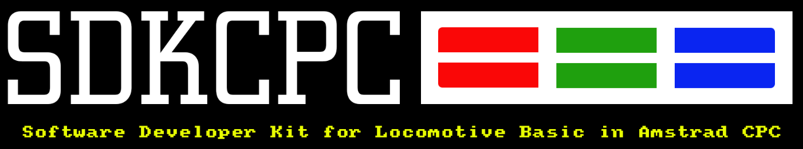

**sdkcpc** son una serie de extensiones, librerias y programas multiplataforma desarrollados en *[Python](https://www.python.org/downloads/)*, que nos sirven para facilitarnos la vida en la programación con Locomotive Amstrad Basic en ordenadores actuales. **sdkcpc** se distribuye bajo licencia [LGPL v3](license.md)

**sdkcpc** incluye: 

- Integración con Vscode
- Visual Studio Code Snnipet para Basic y la libreria [8BP](https://github.com/jjaranda13/8BP)
- Visual Studio Code Language Support para Amstrad Basic y la libreria [8BP](https://github.com/jjaranda13/8BP)
- Integración con gestor de versiones Git
- Generación de DSK
- Comentarios en codigo que no ocupan memoria.
- Trabajo por objetos
- Verificacion formato 8:3
- Compatible con Emulador: Retro Virtual Machine
- Integración con M4-Board
- y mucho más.....

## Requisitos

| Software  | Version  | Url |
|:----------|:----------|:----------|
| Python    | =>3.6    | [Descarga](https://www.python.org/downloads/)    |
| Visual Studio Code    | latest   | [Descarga](https://code.visualstudio.com/download)    |

## Plataformas compatibles

- Windows 10 o Superior
- OS X
- Linux

## Software utilizado

- [Retro Virtual Machine](https://www.retrovirtualmachine.org/)
- [iDSK](https://github.com/cpcsdk/idsk)
